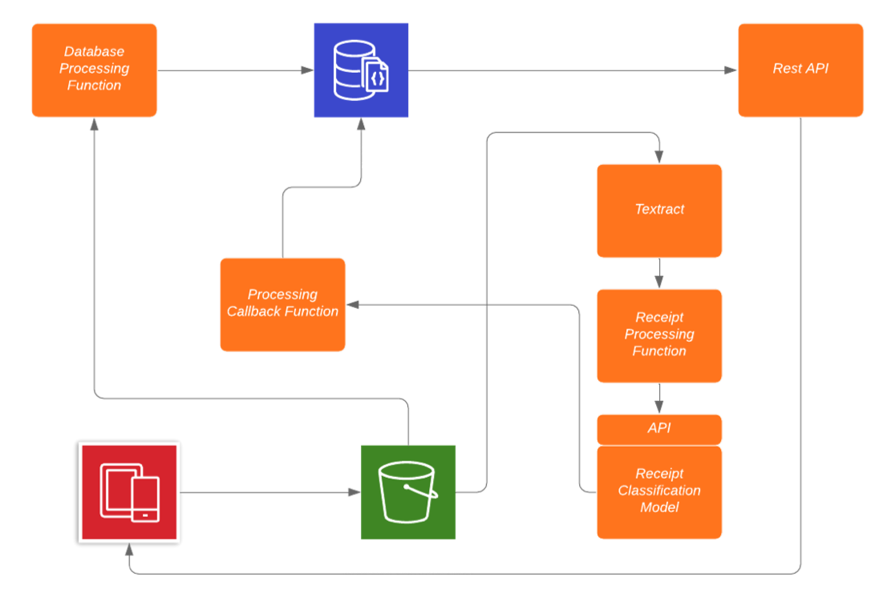
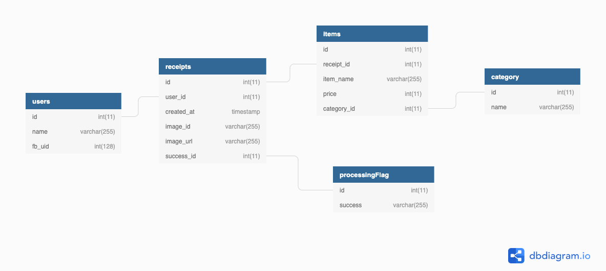
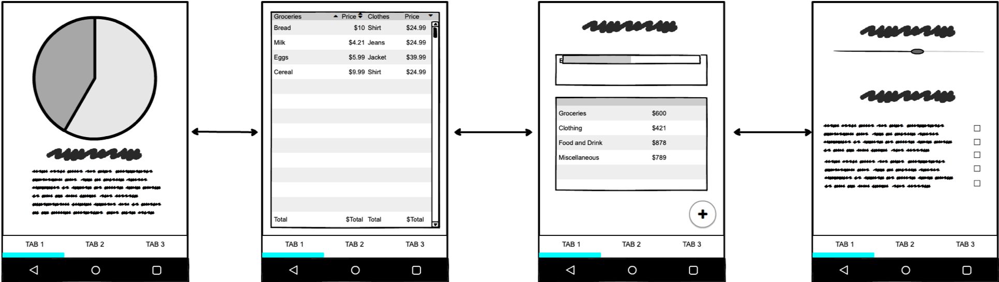

# Receipt Track

## Contributors
Tanay Komarlu, Andrew Kung, Pranav Acharya

## Abstract
This project focuses on multi-class classification to generate a monthly expense report for users to aid in keeping track of their monthly finances. We made use of Linear Support Vector Classification with Sci Kit learn and e-commerce data collected from datasets on Kaggle. We present the results of this classification through the use of a serverless mobile application developed using React Native. The users upload images of receipts which are processed with Textract, Amazon's OCR engine. The extracted data is then classified by our classifier, hosted on SageMaker. The results were promising with about 98 % cross validation score for classifying receipt items based on category with the help of the LinearSVC classifier.

## Motivation
The main purpose of this work was to evaluate how a machine learning approach could be used to simplify and automatize personal expense management. Managing your personal expenses can be a daunting task. We wanted to develop an mobile application for a chain of services from user to database that handled the extraction and classification receipt data. 

## Methodology

### High Level Architecture

Walking through the steps:

1. User takes a photo of the receipt and using the React Native app, chooses to upload the image for processing (AWS S3 Bucket)
2. Once the image is uploaded the React Native app triggers a Lambda function that updates the database with a reference to the image in S3. 
3. This also triggers another Lambda function which passes the image to Textract. Textract allows us to extract the text from the receipts. Textract hands off the actual processing of the text to another lambda function which cleans the extracted text into a formatted JSON which can be processed by our model. 
4. This JSON is handed to our model and classified. Once the processing has completed, success or fail, the results are handed off to the Processing Callback function to update the database. 
5. The React Native app is then updated with the use of a Restful API built with API Gateway. This AWS service allows us to create, deploy, and manage a REST application programming interface (API) to expose our AWS Lambda functions. 

### Database Design

### Data Cleaning

We planned to have our machine learning model classify our products into four categories: Clothing, Entertainment, Food and Drink, Home and Entertainment. So we had to find enough Kaggle datasets such that we had enough training data for each of these categories.

 

Below is an example of the original Kaggle dataset that we downloaded 

| gender | masterCategory | subCategory      | articleType      | baseColour | season | year | usage  | productDisplayName                                    |
|--------|----------------|------------------|------------------|------------|--------|------|--------|-------------------------------------------------------|
| Men    | Apparel        | Topwear          | Shirts           | Navy Blue  | Fall   | 2011 | Casual | Turtle Check Men Navy Blue Shirt                      |
| Men    | Apparel        | Bottomwear       | Jeans            | Blue       | Summer | 2012 | Casual | Peter England Men Party Blue Jeans                    |
| Women  | Accessories    | Watches          | Watches          | Silver     | Winter | 2016 | Casual | Titan Women Silver Watch                              |
| Men    | Apparel        | Bottomwear       | Track Pants      | Black      | Fall   | 2011 | Casual | Manchester United Men Solid Black Track Pants         |
| Men    | Apparel        | Topwear          | Tshirts          | Grey       | Summer | 2012 | Casual | Puma Men Grey T-shirt                                 |
| Men    | Apparel        | Topwear          | Tshirts          | Grey       | Summer | 2011 | Casual | Inkfruit Mens Chain Reaction T-shirt                  |
| Men    | Apparel        | Topwear          | Shirts           | Green      | Summer | 2012 | Ethnic | Fabindia Men Striped Green Shirt                      |
| Women  | Apparel        | Topwear          | Shirts           | Purple     | Summer | 2012 | Casual | Jealous 21 Women Purple Shirt                         |

 

On this original csv file from which we got our clothing data, we separated and used only the Product Display Name column as our clothing category data on which the machine learning model was trained on. The csv files for our other three cateogries simiarly contained extra columns that were not necesssary to train our model, so we removed those columns. 

 

There were also some miscategorized prodcuts such as lemon-flavored soap that were under incorrectly under "Food and Drink" instead of "Home and Office". We had to manually go through the datasets to remove irregularities like these that would have caused  our classifier to incorrectly assign labels to such products. 

### Pre-processing

Using sklearn’s TFIDFVectorizer (Term Frequency Inverse Document Frequency) on the training data, we converted the product names into multi-dimensional numerical vectors based on keyword and temr frequency calculations. This step was necessary because our Sci-Kit Learn LinearSVC Model can only train on numerical data.

### Defining Success

### Design Layout

We utilized React Native to create the frontend for our application. The design of our application contains a login page which leads to a homepage. There is a bottom tab from which an user can access a transaction page, a spending visualization page, and a settings page. From the homepage, we can access a page that allows us upload images from our device to AWS S3 bucket. We structured our application this way because we wanted to keep our application simple for users. Each page has one function which minimizes the amount of actions which users need to take.
